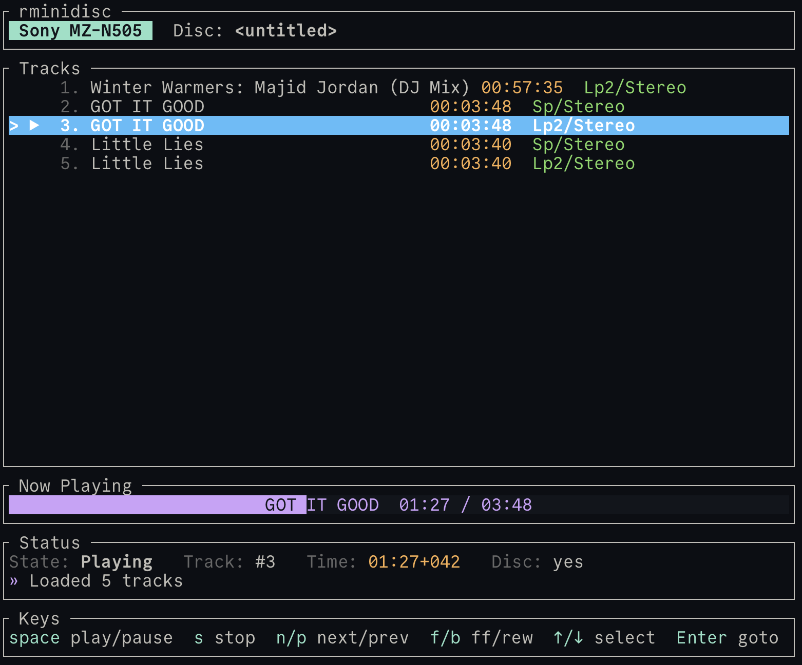

# rminidisc

Pure Rust crates interfacing with NetMD devices via USB, including audio normalization and ATRAC3 encoding via [`atracdenc-rs`](https://github.com/liangchunn/atracdenc-rs).

No `ffmpeg` or `atracdenc` install required.

> [!WARNING]
> The code in this repository are largely written and reviewed with the aid of AI LLMs, and verifying it with a real Sony MZ-N505 on macOS.
>
> I am not responsible for bricking your device! Use at your own risk!

## CLI Usage

```sh
# build the binary in ./target/release/rminidisc
cargo build --release -p rminidisc

# list connected NetMD devices
rminidisc list

# get disc/device info
rminidisc info

# upload a track
rminidisc upload [FILE] --format sp

# upload tracks in a folder
rminidisc upload --folder <FOLDER> --format lp2

# help for commands, works with subcommands too
rminidisc --help
rminidisc upload --help
```

> [!NOTE]
> Windows needs drivers to talk to NetMD devices.
> 
> Install them with [Zadig](https://zadig.akeo.ie/).

### Remote control

<p align="center">
     
</p>

```sh
# interactive playback control
rminidisc control
```

## Crates

### `netmd` — Library

Low-level protocol library for NetMD devices. Provides:

- Device enumeration, open/close
- Disc, track metadata
- Structured disc listing with track groups
- Group editing + TOC title-cell budgeting
- Track upload via secure session (ATRAC3 SP / LP2 / LP4)
- Erase, rename, reorder tracks
- Playback transport (play, pause, stop, seek, ff/rewind, eject)

**Original JS reference:** https://github.com/cybercase/netmd-js

**Ported from commit**: [`5919d93`](https://github.com/cybercase/netmd-js/tree/5919d93c3ae4375806c2d4248495a31f81830b82)

### `md-pcm` — Audio Decode/Normalize Library

Decodes source audio and normalizes it to stereo 44.1 kHz PCM for use by the
upload path. Replaces need for calling out to `ffmpeg`. Provides:

- Streaming decode + resample
- Output as interleaved signed 16-bit big-endian PCM and PCM WAV

## Why this project exists

This started when I was [looking into a better way to parse NetMD messages with a Rust macro](https://liangchun.me/posts/netmd-rust-macros) for funsies.

I intended to "finish" the project but never got the time to do so, therefore the AI port. I didn't include the scan macro into this project because most protocol message shapes are fixed anyway.

One thing after the other, I ended up with a functioning port, and decided to [port atracdenc from C++](https://github.com/liangchunn/atracdenc-rs) as well for the complete RIIR package.

## Acknowledgments

This project has been made possible by:

- [netmd-js](https://github.com/cybercase/netmd-js) (reference impl)
- [linux-minidisc](https://github.com/linux-minidisc/linux-minidisc)
